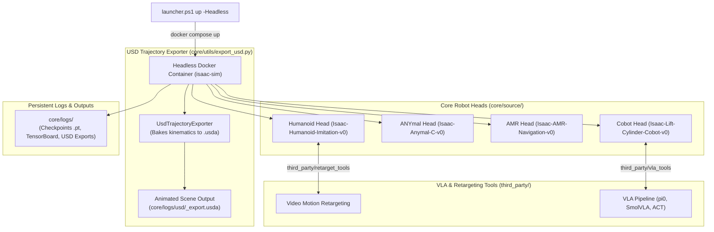

# VIRO IsaacLab: Multi-Robot RL & Vision-Language-Action (VLA) Studio

> **High-Performance Autonomous Robotics Architecture** powering **Humanoid Biped Imitation**, **ANYmal Quadruped Locomotion**, **AMR Mobile Navigation**, and **Cobot VLA ($\pi_0$, SmolVLA, ACT)** in Headless NVIDIA IsaacLab & ROS2.

---

## 1. System Architecture



---

## 2. How to Use

### A. Host PowerShell Launcher (`launcher.ps1`)

The PowerShell launcher provides 1-click execution for building containers, starting services, running RL training, playing trained checkpoints, and exporting USD scene trajectory rollouts.

#### Core CLI Commands:
```powershell
# 1. Build Docker Simulation Container
.\launcher.ps1 build

# 2. Start Headless Simulation Container & TensorBoard
.\launcher.ps1 up -Head humanoid -Headless

# 1. Build & Launch Container Stack (Host PowerShell)
.\launcher.ps1 build
.\launcher.ps1 up -Head humanoid -Headless

# 2. Master Training Command (All Parameters Configured)
# Options:
#  - Native Vulkan Video (Linux/Ubuntu):   .\launcher.ps1 train -Head humanoid -NumEnvs 16 -MaxIterations 1000 -VideoLengthMin 1.0 -VideoIntervalMin 30.0
#  - Headless USD & MP4 (Docker Desktop): 
.\launcher.ps1 train -Head humanoid -NumEnvs 16 -MaxIterations 1000 -UsdExport -VideoLengthMin 1.0 -VideoIntervalMin 30.0

# 3. Master Playback / Inference Command (Evaluate Trained Checkpoint)
.\launcher.ps1 play -Head humanoid -Checkpoint ./core/logs/rsl_rl/humanoid/<run>/model_1000.pt -RealTime -UsdExport

# 4. Convert Any Generated USD Stage to MP4 Video
.\launcher.ps1 export -UsdPath ./core/logs/usd/trajectory_t1.usda

# 5. Management & Logs
.\launcher.ps1 logs               # Stream live container logs
.\launcher.ps1 kill               # Stop running containers
.\launcher.ps1 clean              # Remove container volumes & images
```

#### Available Robot Heads:
- **`humanoid`**: `Isaac-Humanoid-Imitation-v0` (Reference Motion Tracking & Biped Locomotion)
- **`anymal`**: `Isaac-Anymal-C-v0` (ANYmal-C Quadruped Velocity Tracking)
- **`amr`**: `Isaac-AMR-Navigation-v0` (TurtleBot3 Differential Drive Mobile Robot Navigation)
- **`cobot`**: `Isaac-Lift-Cylinder-Cobot-v0` (UR5e 6-DOF Manipulator Target Reaching)

---

### B. Complete `launcher.ps1` Parameter Reference

| Parameter | Type | Default | Applicable Commands | Description |
| :--- | :--- | :--- | :--- | :--- |
| `-Head` | `string` | `"humanoid"` | `up`, `train`, `play`, `export` | Selects target robot head (`humanoid`, `anymal`, `amr`, `cobot`). |
| `-Task` | `string` | *Derived* | `train`, `play`, `export` | Override default task name (e.g. `Isaac-Humanoid-Imitation-v0`). |
| `-NumEnvs` | `int` | `16` | `train`, `play` | Number of parallel simulation environments running on GPU. |
| `-MaxIterations` | `int` | `0` *(unlimited)* | `train` | Stop training automatically after specified number of iterations. |
| `-Checkpoint` | `string` | *None* | `play`, `export` | Path to saved PyTorch policy weights (`.pt` file). |
| `-Video` | `bool` | `$true` | `train`, `play`, `export` | Enable/disable periodic video recording during simulation. |
| `-VideoLengthMin` | `double` | `1.0` | `train`, `play` | Duration of recorded video clip in minutes of simulation time. |
| `-VideoIntervalMin` | `double` | `30.0` | `train`, `play` | Interval between video recording starts in minutes of sim time. |
| `-ExportSeconds` | `double` | `5.0` | `export` | Duration of rollout trajectory to bake into USD scene file. |
| `-ExportFormat` | `string` | `"usda"` | `export` | USD file output format (`usda` text, `usdc` binary, `usd`). |
| `-RealTime` | `switch` | `$false` | `play` | Throttle playback execution to real-world wall-clock speed. |
| `-Headless` | `switch` | `$false` | `up` | Launch container in headless mode without local GUI display. |

---

### C. Live TensorBoard Monitoring

TensorBoard automatically monitors all training runs. When the container stack is active (`.\launcher.ps1 up`), TensorBoard serves the metric tree live:

- **URL**: [http://localhost:6006](http://localhost:6006)
- **Log Path**: `core/logs/rsl_rl/`

---

### D. Video & Visual Rollout Recording Modes

Depending on your host environment, you can capture simulation video clips using two different methods:

#### Option 1: Native NVIDIA Vulkan Video Recording (Native Linux / Ubuntu with Vulkan drivers)
NVIDIA's intrinsic `--video` flags record MP4 clips via Omniverse's Vulkan camera renderer:
```bash
/isaac-sim/python.sh /workspace/isaaclab/scripts/reinforcement_learning/rsl_rl/train.py \
    --task Isaac-Humanoid-Imitation-v0 --headless --video --video_length 3600 --video_interval 108000 --enable_cameras
```
*(Requires host Vulkan ICD graphics drivers).*

#### Option 2: Automated USD & MP4 Video Export (Docker Desktop / WSL2 without Vulkan drivers)
In headless Docker Desktop or environments without Vulkan driver access, visual rollouts are captured automatically during simulation (`train` or `play`) using `PeriodicUsdExporterWrapper` ([core/utils/usd_exporter.py](file:///c:/Users/azeez.adebayo/env_ideahub/ideahub/isaaclab/core/utils/usd_exporter.py)).

The wrapper captures $Y$ seconds of rollout trajectory every $X$ seconds interval (`USD_EXPORT=1 USD_INTERVAL=1800 USD_LENGTH=10`), baking `trajectory_t1.usda` and automatically converting it into `trajectory_t1.mp4` via `usd_to_mp4.py` ([core/utils/usd_to_mp4.py](file:///c:/Users/azeez.adebayo/env_ideahub/ideahub/isaaclab/core/utils/usd_to_mp4.py)) with **zero Vulkan dependencies**:

```bash
# Standalone Conversion of any .usda stage to .mp4 video:
/isaac-sim/python.sh core/utils/usd_to_mp4.py core/logs/usd/trajectory_t1.usda
```

The resulting `.usda` and `.mp4` files save straight to `/workspace/core/logs/usd/` and can be opened in web USD viewers ([usd-viewer.needle.tools](https://usd-viewer.needle.tools/)), Blender, or standard video players.

---

### E. Direct In-Container CLI Execution

If executing directly inside the running container (`docker exec -w /workspace isaac-sim bash`):

#### 1. Humanoid Motion Retargeting & Training
```bash
# Retarget RGB video to humanoid reference motion JSON
bash third_party/retarget_tools/run_retarget.sh \
    third_party/retarget_tools/bodypose3d/media/cam0_test.mp4 \
    core/data/motion_capture

# Train Humanoid Policy
/isaac-sim/python.sh /workspace/isaaclab/scripts/reinforcement_learning/rsl_rl/train.py \
    --task Isaac-Humanoid-Imitation-v0 --headless --num_envs 16
```

#### 2. ANYmal Quadruped & AMR Mobile Robot Training
```bash
# ANYmal-C Quadruped
/isaac-sim/python.sh /workspace/isaaclab/scripts/reinforcement_learning/rsl_rl/train.py \
    --task Isaac-Anymal-C-v0 --headless --num_envs 16

# AMR TurtleBot3 Navigation
/isaac-sim/python.sh /workspace/isaaclab/scripts/reinforcement_learning/rsl_rl/train.py \
    --task Isaac-AMR-Navigation-v0 --headless --num_envs 16
```

#### 3. Cobot Vision-Language-Action (VLA) Fine-Tuning ($\pi_0$, SmolVLA, ACT)
```bash
# 1-Click Master VLA Pipeline
bash third_party/vla_tools/run_vla_pipeline.sh pi0

# Manual Fine-Tuning
python3 core/source/cobot/vla/train_vla.py \
    --model pi0 \
    --pretrained_hub lerobot/pi0_ur5 \
    --dataset core/data/vla/cobot_vla_dataset.h5 \
    --output_dir core/logs/vla
```

---

## 3. ROS2 Integration

The container automatically sources ROS2 Humble and the workspace ROS2 environment (`/workspace/ros_ws/install/setup.bash`).

### Launch Robot State Publisher & TF Frames
```bash
# Broadcast TF tree for selected head (humanoid | anymal | amr | cobot)
ros2 launch viro_ros2_ws robot_state_publisher.launch.py robot_type:=cobot
```
