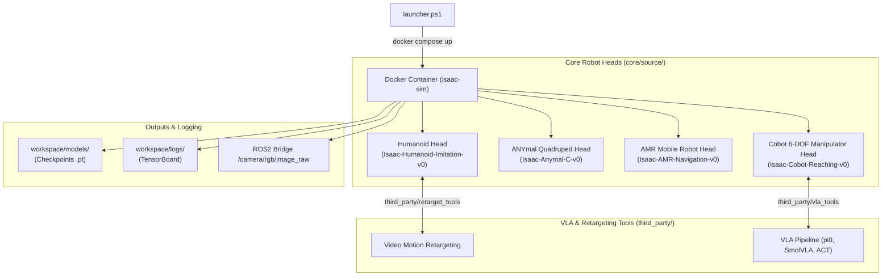

# VIRO IsaacLab: Multi-Robot RL & Vision-Language-Action (VLA) Studio

> **High-Performance Autonomous Robotics Architecture** powering **Humanoid Biped Imitation**, **ANYmal Quadruped Locomotion**, **AMR Mobile Navigation**, and **Cobot VLA ($\pi_0$, SmolVLA, ACT)** in Nvidia IsaacLab & ROS2.

---

## 1. System Architecture Flowchart



---

## 2. Directory Structure Tree

```text
viro_isaaclab/
├── launcher.ps1                  # Master PowerShell Launcher Script
├── workspace/                    # Standardized Output Directory
│   ├── models/                   # Saved Policy Checkpoints (.pt)
│   └── logs/                     # TensorBoard & Console Training Logs
├── core/
│   ├── utils/
│   │   └── video_recorder.py     # Universal Video Recorder & ROS2 Streamer
│   ├── ros2_ws/                  # Multi-Robot ROS2 Bridge & State Publisher
│   ├── data/                     # Datasets (Motion Capture & VLA JSON)
│   └── source/                   # Core Robot Heads
│       ├── humanoid/             # 17-DOF Biped Motion Tracking
│       ├── anymal/               # 12-DOF ANYmal-C Locomotion
│       ├── amr/                  # 2-Wheel Differential Drive Navigation
│       ├── cobot/                # 6-DOF UR5 Serial Manipulator Arm
│       └── register_tasks.py     # Centralized Gym Task Discovery
└── third_party/                  # 1-Click Helper Tools
    ├── retarget_tools/           # Video-to-Humanoid Retargeting Suite
    └── vla_tools/                # 1-Click VLA Fine-Tuning Suite
```

---

## 3. First-Principles Usage: PowerShell Launcher (`launcher.ps1`)

The PowerShell launcher `launcher.ps1` manages Docker container deployment, headless training, and noVNC web browser simulation rendering.

### A. Build Docker Containers
```powershell
.\launcher.ps1 build
```

### B. Launch Humanoid Biped Imitation Head
```powershell
# Headless Mode
.\launcher.ps1 up -Head humanoid -Headless

# Web Browser Visualization (http://localhost:6080/vnc.html)
.\launcher.ps1 up -Head humanoid -Viz -Task Isaac-Humanoid-Imitation-v0
```

### C. Launch ANYmal Quadruped Head
```powershell
# Headless Mode
.\launcher.ps1 up -Head anymal -Headless

# Web Browser Visualization
.\launcher.ps1 up -Head anymal -Viz -Task Isaac-Anymal-C-v0
```

### D. Launch AMR Mobile Robot Head
```powershell
# Headless Mode
.\launcher.ps1 up -Head amr -Headless

# Web Browser Visualization
.\launcher.ps1 up -Head amr -Viz -Task Isaac-AMR-Navigation-v0
```

### E. Launch Cobot Manipulator & VLA Head
```powershell
# Headless Mode
.\launcher.ps1 up -Head cobot -Headless

# Web Browser Visualization
.\launcher.ps1 up -Head cobot -Viz -Task Isaac-Cobot-Reaching-v0
```

### F. Container Lifecycle Operations
```powershell
.\launcher.ps1 logs               # View live simulation logs
.\launcher.ps1 kill               # Stop containers
.\launcher.ps1 clean              # Wipe volumes & container instances
```

---

## 4. First-Principles Commands: Training & Tools

### A. Humanoid Video Motion Retargeting & Training
```bash
# 1. Retarget RGB video to humanoid reference motion JSON
bash third_party/retarget_tools/run_retarget.sh \
    third_party/retarget_tools/bodypose3d/media/cam0_test.mp4 \
    core/data/motion_capture

# 2. Train Humanoid Imitation Policy
python3 /workspace/isaaclab/scripts/reinforcement_learning/rsl_rl/train.py \
    --task Isaac-Humanoid-Imitation-v0 \
    --headless
```

### B. ANYmal Quadruped Training
```bash
python3 /workspace/isaaclab/scripts/reinforcement_learning/rsl_rl/train.py \
    --task Isaac-Anymal-C-v0 \
    --headless
```

### C. AMR Mobile Robot Training
```bash
python3 /workspace/isaaclab/scripts/reinforcement_learning/rsl_rl/train.py \
    --task Isaac-AMR-Navigation-v0 \
    --headless
```

### D. Cobot Vision-Language-Action (VLA) Fine-Tuning ($\pi_0$, SmolVLA, ACT)
```bash
# 1-Click Master VLA Pipeline (Inspect -> Fine-Tune lerobot/pi0_ur5 -> Inference)
bash third_party/vla_tools/run_vla_pipeline.sh pi0

# Manual Fine-Tuning
python3 core/source/cobot/vla/train_vla.py \
    --model pi0 \
    --pretrained_hub lerobot/pi0_ur5 \
    --dataset core/data/vla/cobot_vla_sample_dataset.json \
    --output_dir workspace/models/vla
```

---

## 5. Live ROS2 Integration & Camera Video Streaming

### A. Launch Dynamic ROS2 Coordinate Frame (/tf Tree)
```bash
# Humanoid Biped
ros2 launch viro_ros2_ws robot_state_publisher.launch.py robot_type:=humanoid

# ANYmal Quadruped
ros2 launch viro_ros2_ws robot_state_publisher.launch.py robot_type:=anymal

# AMR Mobile Robot
ros2 launch viro_ros2_ws robot_state_publisher.launch.py robot_type:=amr

# Cobot Arm
ros2 launch viro_ros2_ws robot_state_publisher.launch.py robot_type:=cobot
```

### B. View Live Headless Simulation Video Stream
```bash
# Run provided ROS2 camera listener node (/camera/rgb/image_raw)
python3 core/ros2_ws/image_listener.py

# OR run rqt_image_view
ros2 run rqt_image_view rqt_image_view /camera/rgb/image_raw
```
