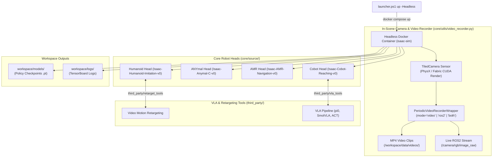

# VIRO IsaacLab: Multi-Robot RL & Vision-Language-Action (VLA) Studio

> **High-Performance Autonomous Robotics Architecture** powering **Humanoid Biped Imitation**, **ANYmal Quadruped Locomotion**, **AMR Mobile Navigation**, and **Cobot VLA ($\pi_0$, SmolVLA, ACT)** in Headless Nvidia IsaacLab & ROS2.

---

## 1. System Architecture Flowchart



---

## 2. Headless Camera Tuning & Video Recording Guide

Headless Docker containers execute GPU physics without needing X11 display servers or VNC. Visual feedback is delivered via **In-Scene `TiledCamera` Sensors** and **`PeriodicVideoRecorderWrapper`** (`core/utils/video_recorder.py`).

### A. Tuning the In-Scene Camera Position & Resolution
Camera configurations are defined in each robot scene file:
- **Humanoid**: `core/source/humanoid/tasks/humanoid_env_cfg.py`
- **ANYmal**: `core/source/anymal/tasks/anymal_env_cfg.py`
- **AMR**: `core/source/amr/tasks/amr_env_cfg.py`
- **Cobot**: `core/source/cobot/tasks/cobot_env_cfg.py`

#### Code Snippet: Customizing Camera Position, Angle, and Resolution
```python
from isaaclab.sensors import TiledCameraCfg
import isaaclab.sim as sim_utils

tiled_camera = TiledCameraCfg(
    prim_path="{ENV_REGEX_NS}/Robot/base_link/front_cam",
    # 1. Position Offset (x, y, z) in meters relative to robot base
    # 2. Rotation Quaternion (w, x, y, z)
    offset=TiledCameraCfg.OffsetCfg(
        pos=(2.0, 0.0, 1.5),             # Camera 2m behind, 1.5m above robot
        rot=(0.92388, 0.0, 0.38268, 0.0), # Pitched 45 degrees downward
        convention="world",
    ),
    data_types=["rgb"],
    spawn=sim_utils.PinholeCameraCfg(
        focal_length=24.0,              # Lens focal length in mm
        focus_distance=400.0,
        horizontal_aperture=20.955,
        clipping_range=(0.1, 100.0),
    ),
    width=1280,                          # Custom Image Width (e.g. 720p / 1080p)
    height=720,                          # Custom Image Height
)
```

---

### B. Setting Video Capture Frequency & Duration

Wrap any RL environment using `PeriodicVideoRecorderWrapper` (`core/utils/video_recorder.py`) to customize recording intervals, duration, and output modes:

```python
from core.utils.video_recorder import PeriodicVideoRecorderWrapper

env = PeriodicVideoRecorderWrapper(
    env,
    mode="both",                        # Options: 'video' (MP4 file), 'ros2' (Live Stream), 'both'
    video_folder="/workspace/data/videos",
    record_interval_s=1800.0,           # Frequency: Record 1 video clip every 30 minutes (1800s)
    video_length_s=60.0,                # Duration: Record 60 seconds (1 minute) per clip
    fps=30,                             # Frame rate for saved MP4 files
    ros2_topic="/camera/rgb/image_raw",  # Live ROS2 video topic
)
```

#### Mode Parameters Table

| Mode Option | Description | Output Location / Topic |
|-------------|-------------|-------------------------|
| `mode="video"` | **(DEFAULT)** Direct MP4 video recording to file system | `/workspace/data/videos/sim_clip_*.mp4` |
| `mode="ros2"` | Real-time live ROS2 camera topic streaming | Topic `/camera/rgb/image_raw` |
| `mode="both"` | Concurrently records MP4 files AND streams live ROS2 topic | MP4 File + Topic `/camera/rgb/image_raw` |

---

## 3. PowerShell Launcher Usage (`launcher.ps1`)

```powershell
# 1. Build Docker Simulation Container
.\launcher.ps1 build

# 2. Launch Humanoid Biped Head
.\launcher.ps1 up -Head humanoid -Headless

# 3. Launch ANYmal Quadruped Head
.\launcher.ps1 up -Head anymal -Headless

# 4. Launch AMR Mobile Robot Head
.\launcher.ps1 up -Head amr -Headless

# 5. Launch Cobot Manipulator Head
.\launcher.ps1 up -Head cobot -Headless

# 6. Container Logs & Cleanup
.\launcher.ps1 logs               # View live simulation logs
.\launcher.ps1 kill               # Stop containers
.\launcher.ps1 clean              # Remove container volumes
```

---

## 4. First-Principles CLI Execution

### A. Humanoid Motion Retargeting & RL Training
```bash
# Retarget RGB video to humanoid reference motion JSON
bash third_party/retarget_tools/run_retarget.sh \
    third_party/retarget_tools/bodypose3d/media/cam0_test.mp4 \
    core/data/motion_capture

# Train Humanoid Policy
python3 /workspace/isaaclab/scripts/reinforcement_learning/rsl_rl/train.py \
    --task Isaac-Humanoid-Imitation-v0 \
    --headless
```

### B. ANYmal & AMR Locomotion Training
```bash
# ANYmal Quadruped
python3 /workspace/isaaclab/scripts/reinforcement_learning/rsl_rl/train.py --task Isaac-Anymal-C-v0 --headless

# AMR Mobile Robot
python3 /workspace/isaaclab/scripts/reinforcement_learning/rsl_rl/train.py --task Isaac-AMR-Navigation-v0 --headless
```

### C. Cobot Vision-Language-Action (VLA) Fine-Tuning ($\pi_0$, SmolVLA, ACT)
```bash
# 1-Click Master VLA Pipeline (Inspect -> Fine-Tune lerobot/pi0_ur5 -> Inference)
bash third_party/vla_tools/run_vla_pipeline.sh pi0

# Manual Fine-Tuning
python3 core/source/cobot/vla/train_vla.py \
    --model pi0 \
    --pretrained_hub lerobot/pi0_ur5 \
    --dataset core/data/vla/cobot_vla_sample_dataset.json \
    --output_dir workspace/models/vla
```

---

## 5. Live ROS2 Video Stream Viewing

### A. Launch Dynamic ROS2 Coordinate Frame (/tf Tree)
```bash
# Select robot head: humanoid | anymal | amr | cobot
ros2 launch viro_ros2_ws robot_state_publisher.launch.py robot_type:=cobot
```

### B. View Live Simulation Camera Feed
```bash
# Run provided ROS2 camera listener node
python3 core/ros2_ws/image_listener.py

# OR run rqt_image_view
ros2 run rqt_image_view rqt_image_view /camera/rgb/image_raw
```
